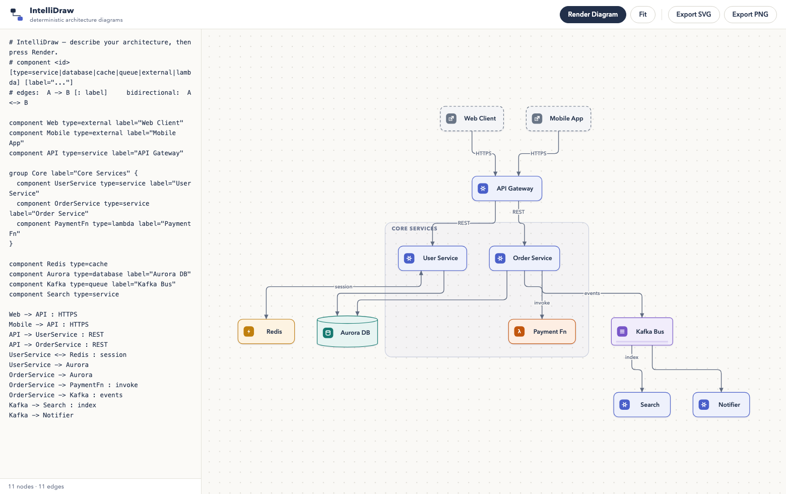

# IntelliDraw

Fully client-side architecture diagram generator. Describe components and
connections in a small text DSL; a deterministic Sugiyama layout engine
(no AI, no backend) produces a clean, professional diagram with orthogonal
edge routing, rendered as SVG.



## Run

```bash
npm install
npm run dev      # http://localhost:5173
npm test         # unit + property + performance tests
npm run build    # production bundle in dist/
```

## DSL reference

```text
# comments start with # or //

component API type=service label="API Gateway" color=#eef1fc
component Aurora type=database

group Core label="Core Services" {
  component UserService
  component OrderService
}

API -> UserService : REST        # directed edge with label
UserService <-> Redis : session  # bidirectional
Kafka -> Notifier                # undeclared nodes are auto-created as services
```

- **Types:** `service` (default), `database`, `cache`, `queue`, `external`, `lambda`
- **Groups** draw a container frame around their members
- **Cycles** are fine — the engine breaks them for layout and restores arrow direction

## Interaction

- **Render Diagram** (or ⌘/Ctrl-Enter in the editor) re-parses and re-lays-out
- Wheel = zoom (cursor-anchored) · drag background = pan · drag node = move it
  (edges re-route live) · **Fit** recenters
- Drag the divider between the editor and the canvas to resize the editor pane
- **Export SVG / PNG** downloads the current diagram (PNG at 2×)
- **Layout** dropdown switches the placement engine: *Classic* (compact
  median-based Sugiyama) or *Symmetric* (parents centered over their
  children, vertical edges wherever alignment allows). The choice is
  remembered across sessions.

## Architecture

```
src/dsl/       parser: DSL text -> declarations + line-numbered errors
src/graph/     graph model (nodes, edges, groups; auto-created endpoints)
src/layout/    deterministic Sugiyama pipeline:
                 cycles.ts       DFS cycle breaking
                 layering.ts     longest-path layering + pull-up
                 ordering.ts     barycenter crossing minimization
                                 (group-contiguity constrained)
                 positioning.ts  median coordinate assignment, no overlaps
                 symmetric.ts    alternative engine: primary-parent tree
                                 contours + isotonic order repair
                 measure.ts      content-based node sizing (deterministic)
                 collision.ts    rect/segment intersection utilities
                 index.ts        LayoutEngine interface + SugiyamaLayout
src/routing/   orthogonal (Manhattan) edge routing: side ports, per-channel
               tracks — edges never cross node rectangles
src/render/    SVG React components (typed shapes, rounded bends, arrowheads)
src/app/       editor, viewport (zoom/pan), node drag, export
```

The renderer consumes only positioned/routed geometry (`LayoutResult`,
`RoutedEdge[]`), so alternative layout engines (radial, force-directed, …)
can implement `LayoutEngine` without touching the renderer.

Identical input always produces the identical diagram. Performance targets
(enforced by tests): 100 nodes < 100 ms · 500 < 500 ms · 1000 < 2 s.
